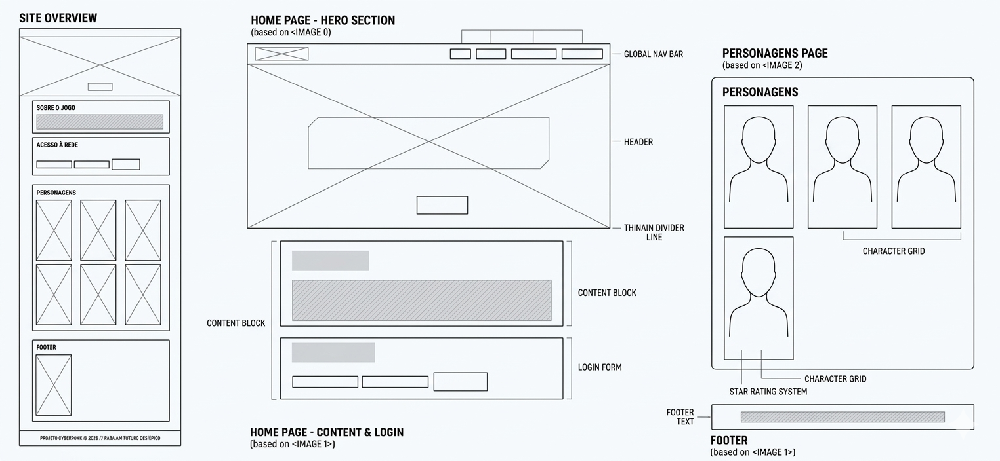

# Trabalho Prático - Semana 04

## Informações Gerais

- Nome: Pamela Fernandes Nilo
- Matricula:1664522
- Proposta de projeto escolhida: Cyberpunk
- Breve descrição sobre seu projeto: O projeto consiste no desenvolvimento de um site inspirado no universo do jogo Cyberpunk 2077. A proposta não é apenas criar uma página informativa tradicional, mas sim uma experiência imersiva que reflita a estética e a atmosfera do jogo.

Diferente de uma fan page convencional, o site busca proporcionar uma experiência mais imersiva e autoral, integrando informações sobre o jogo, como narrativa, personagens e curiosidades, com percepções pessoais adquiridas durante minha experiência jogando.

## Print do(s) wireframe(s) criado

## Print da home-page criada

[Print da home-page criada](public/img_readme/captura_tela_carregamento.png)

[Print da home-page criada](public/img_readme/captura_homepage.png)

[Print da home-page criada](public/img_readme/captura_homepage2.png)

[Print da home-page criada](public/img_readme/captura_personagens.png)

